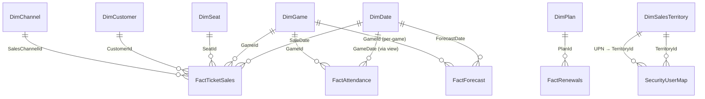

# 🏀 NBA Ticketing & Renewal Optimization (Capstone 2025)

[](#)
[](#)
[](#)
[](#)
[](#)

> **TL;DR**: Azure SQL star-schema + ADF daily loads → Power BI (Import, Incremental Refresh, RLS) → Python forecasts (Prophet + rule-based). The model flags under-priced weeknights & upsell cohorts and projects renewal lift.

---

## ✨ Highlights

* **Unified data → insight**: 5M+ rows (tickets, renewals, CRM, games) blended into **Azure SQL star-schema** with T-SQL ETL, daily loads via **ADF**.
* **Actionable visuals**: 30+ **DAX** measures, exec KPI scorecards, cohort/renewal funnels, pricing flags, drill-through game detail. **Row-level security** by sales territory (UPN→TerritoryId).
* **Forecasting**: Embedded **Prophet** (attendance) + **MA28 weekend-adjusted** (revenue) with **per-game** downscaling.
* **Performance**: **Incremental Refresh** (store 5y, refresh 60d), staging excluded from model, helpful indexes.

---

---

## 🧱 Star Schema



---

## 📁 Repo Structure

```
├─ sql/
│  ├─ 00_create_schema.sql
│  ├─ 01_dims.sql
│  ├─ 02_facts.sql
│  ├─ 03_staging.sql
│  ├─ 04_indexes.sql
│  ├─ 10_sp_loads.sql
│  └─ extras/vw_FactAttendance.sql
├─ data/
│  └─ synthetic/
│     ├─ games.csv
│     ├─ seats.csv
│     ├─ customers.csv
│     ├─ attendance.csv
│     ├─ renewals.csv
│     ├─ channels.csv
│     ├─ plans.csv
│     ├─ territories.csv
│     ├─ security_user_map.csv
│     └─ tickets*.csv   # tickets.csv or chunked files
├─ python/
│  ├─ forecast_job.py
│  ├─ requirements.txt
│  ├─ .env.example
│  └─ README.md
├─ powerbi/
│  ├─ measures.dax
│  └─ theme.json
├─ adf/
│  └─ factory/           # optional ARM templates
├─ docs/
│  ├─ runbook.md
│  └─ data_dictionary.md
└─ assets/
   └─ *.png (screenshots)
```

---

## ⚡ Quickstart

### 1) Azure SQL — create schema

Run in order:

```text
sql/00_create_schema.sql
sql/01_dims.sql
sql/02_facts.sql
sql/03_staging.sql
sql/04_indexes.sql
sql/10_sp_loads.sql
```

Create the attendance view (folding & partitioning by GameDate):

```sql
CREATE OR ALTER VIEW dbo.vw_FactAttendance AS
SELECT
    fa.AttendanceId,
    fa.GameId,
    fa.ScannedCount,
    fa.NoShowCount,
    fa.GateOpenTime,
    fa.ModifiedAt,
    g.GameDate
FROM dbo.FactAttendance fa
JOIN dbo.DimGame g ON g.GameId = fa.GameId;
```

### 2) Load synthetic data (bcp, Windows)

```bat
set SVR=your-sql-server.database.windows.net
set DB=nba-analytics
set U=youruser
set P=yourpass

REM robust flags: UTF-8, LF row end, skip header, batch size
bcp dbo.stg_Game_csv in "data\synthetic\games.csv" -S %SVR% -d %DB% -U %U% -P %P% -c -C 65001 -t, -r 0x0a -F 2 -b 50000
bcp dbo.stg_Seat      in "data\synthetic\seats.csv"      -S %SVR% -d %DB% -U %U% -P %P% -c -C 65001 -t, -r 0x0a -F 2 -b 50000
bcp dbo.stg_Customer  in "data\synthetic\customers.csv"  -S %SVR% -d %DB% -U %U% -P %P% -c -C 65001 -t, -r 0x0a -F 2 -b 50000
bcp dbo.stg_Attendance in "data\synthetic\attendance.csv" -S %SVR% -d %DB% -U %U% -P %P% -c -C 65001 -t, -r 0x0a -F 2 -b 50000
bcp dbo.stg_Renewals   in "data\synthetic\renewals.csv"   -S %SVR% -d %DB% -U %U% -P %P% -c -C 65001 -t, -r 0x0a -F 2 -b 50000
bcp dbo.stg_Channel    in "data\synthetic\channels.csv"   -S %SVR% -d %DB% -U %U% -P %P% -c -C 65001 -t, -r 0x0a -F 2 -b 50000
bcp dbo.stg_Plan       in "data\synthetic\plans.csv"      -S %SVR% -d %DB% -U %U% -P %P% -c -C 65001 -t, -r 0x0a -F 2 -b 50000
bcp dbo.stg_Territory  in "data\synthetic\territories.csv"-S %SVR% -d %DB% -U %U% -P %P% -c -C 65001 -t, -r 0x0a -F 2 -b 50000
bcp dbo.stg_SecurityUserMap in "data\synthetic\security_user_map.csv" -S %SVR% -d %DB% -U %U% -P %P% -c -C 65001 -t, -r 0x0a -F 2 -b 50000
REM tickets may be chunked; run each chunk
bcp dbo.stg_TicketSales in "data\synthetic\tickets.csv" -S %SVR% -d %DB% -U %U% -P %P% -c -C 65001 -t, -r 0x0a -F 2 -b 50000
```

Load dims & facts:

```sql
EXEC dbo.sp_Load_DimGame;
EXEC dbo.sp_Load_DimSeat;
EXEC dbo.sp_Load_DimCustomer;
EXEC dbo.sp_Load_DimChannel;
EXEC dbo.sp_Load_DimPlan;
EXEC dbo.sp_Load_DimTerritory;
EXEC dbo.sp_Load_SecurityUserMap;

EXEC dbo.sp_Load_FactTicketSales;
EXEC dbo.sp_Load_FactAttendance;
EXEC dbo.sp_Load_FactRenewals;
```

### 3) Forecasting job (Python)

```bash
cd python
pip install -r requirements.txt
cp .env.example .env   # fill SQL creds
python forecast_job.py
```

* Writes **aggregate** (GameId=0) 56-day **Attendance** (Prophet or MA28) & **Revenue** (MA28) to `dbo.FactForecast`.
* Writes **per-game** forecast rows for future games.

Re-run safe:

```sql
DELETE dbo.FactForecast WHERE ForecastDate >= CAST(SYSDATETIME() AS date);
```

### 4) Power BI model

* **Get Data → Azure SQL → Import**: `Dim*`, `Fact*`, `SecurityUserMap`, `vw_FactAttendance`.
* **Parameters**: `RangeStart`/`RangeEnd` (Date/Time).
* **Filters (Power Query)**:

  * FactTicketSales: `SaleDate >= RangeStart and < RangeEnd`
  * vw\_FactAttendance: `GameDate >= RangeStart and < RangeEnd`
* **Incremental Refresh**: Store 5 years, Refresh last 60 days, Detect changes = `ModifiedAt`.
* **Relationships**:

  * `DimDate[Date]` (1) → `FactTicketSales[SaleDate]` (\*)
  * `DimDate[Date]` (1) → `vw_FactAttendance[GameDate]` (\*)
  * `DimDate[Date]` (1) → `FactForecast[ForecastDate]` (\*)
  * `DimGame[GameId]` (1) → `FactTicketSales / vw_FactAttendance / FactForecast[GameId]` (\*)
* **RLS (TerritoryUser)**:

```DAX
DimSalesTerritory[TerritoryId] IN
  CALCULATETABLE(
    VALUES(SecurityUserMap[TerritoryId]),
    SecurityUserMap[UPN] = USERPRINCIPALNAME()
  )
```

* **Measures**: see `powerbi/measures.dax` (30+ measures; pricing flags, YoY, funnel, forecast hooks). Optional Word doc: `docs/NBA_Measures_DAX.docx`.

### 5) ADF daily automation (3:00 AM CT)

Create the master proc:

```sql
CREATE OR ALTER PROCEDURE dbo.sp_Run_Daily_Load AS
BEGIN
  SET NOCOUNT ON;
  EXEC dbo.sp_Load_DimGame;
  EXEC dbo.sp_Load_DimSeat;
  EXEC dbo.sp_Load_DimCustomer;
  EXEC dbo.sp_Load_DimChannel;
  EXEC dbo.sp_Load_DimPlan;
  EXEC dbo.sp_Load_DimTerritory;
  EXEC dbo.sp_Load_SecurityUserMap;
  EXEC dbo.sp_Load_FactTicketSales;
  EXEC dbo.sp_Load_FactAttendance;
  EXEC dbo.sp_Load_FactRenewals;
END
```

In **ADF Studio**: Pipeline `PL_Master_Daily` → **Stored Procedure** activity calling `dbo.sp_Run_Daily_Load` → **Trigger** 03:00 AM (Central) → Publish.

---

## 📊 Pages & Visuals

* **Exec KPI**: Cards (Net Revenue, Tickets, ATP, YoY, Discount Rate), Revenue vs LY (line), Gross→Net (waterfall), Revenue by Channel (stacked).
* **Pricing & Demand**: ATP by Zone/Opponent, Underpriced Weeknights table (flag), Lead-time distribution, Discount Rate by Channel, ARPA card.
* **Attendance & Ops**: Attendance trend, Show vs No-show (stacked), Show Rate, Weekend/Promo uplifts, Tickets/game vs Revenue/game (scatter).
* **Renewals**: Renewal Rate, Churn %, Renewal Amount, Renewal Upsell %, Funnel, Plan & Territory breakdowns.
* **Forecast**: 8-week Attendance & Revenue (lines), Variance bars, MAPE card.
* **Game Drill-Through**: Header (Opponent/Date/Promo), Revenue & Attendance cards, ATP vs Discount by Zone, Show vs No-show donut, Lead-time histogram.

---

## 📐 Performance & Scaling

* **Incremental Refresh** with Detect changes on `ModifiedAt`.
* Keep **staging** queries **Enable load = Off** in Power BI.
* **Indexes**: `FactForecast (GameId, ForecastDate, Metric)`; consider columnstore on large facts.
* **DAX hygiene**: additive measures, avoid heavy iterators on big facts; push calc logic to SQL when practical.
* **Aggregations**: add weekly/monthly agg tables if usage grows.

---

## 🛠️ Troubleshooting

* **Duplicate on one side (FactForecast)** → Ensure **DimDate** is 1-side, **FactForecast** is many-side.
* **Folding/IR errors** → Apply RangeStart/End directly to fact columns; use `vw_FactAttendance` for `GameDate`.
* **Fact MERGE duplicate key** → dedupe staging (TicketId) before loaders.
* **No revenue forecast** → MA28 fallback ensures values; verify rows in `FactTicketSales`.

---

## 🧪 Validation Snippets

```sql
-- Fact counts
SELECT 'TicketSales', COUNT(*) FROM dbo.FactTicketSales
UNION ALL SELECT 'Attendance', COUNT(*) FROM dbo.FactAttendance
UNION ALL SELECT 'Renewals', COUNT(*) FROM dbo.FactRenewals;

-- Forecast presence next 7 days
SELECT Metric, COUNT(*)
FROM dbo.FactForecast
WHERE ForecastDate BETWEEN CAST(SYSDATETIME() AS date) AND DATEADD(day,7, CAST(SYSDATETIME() AS date))
GROUP BY Metric;
```

---

## 📜 License

MIT — feel free to fork, tweak, and build on this.

---

## 🙌 Credits

Built with 💛 for analytics craft: **Azure SQL**, **Azure Data Factory**, **Power BI**, **Python/Prophet**, **DAX**.

---

### Appendix: Key Measures (excerpt)

> Full set in `powerbi/measures.dax`.

```DAX
Revenue := SUM(FactTicketSales[Revenue])
Tickets := COUNTROWS(FactTicketSales)
Avg Ticket Price := DIVIDE([Revenue],[Tickets])
Discount Rate := DIVIDE([Discounts],[Gross Box Office])
Revenue YoY % := DIVIDE([Revenue]-[Revenue LY],[Revenue LY])
Attendance := SUM(FactAttendance[ScannedCount])
Show Rate (Tickets) := DIVIDE([Attendance],[Tickets])
Forecast Attendance (8wk) :=
  CALCULATE(SUM(FactForecast[ForecastValue]), FactForecast[Metric]="Attendance", FactForecast[GameId]=0)
```
